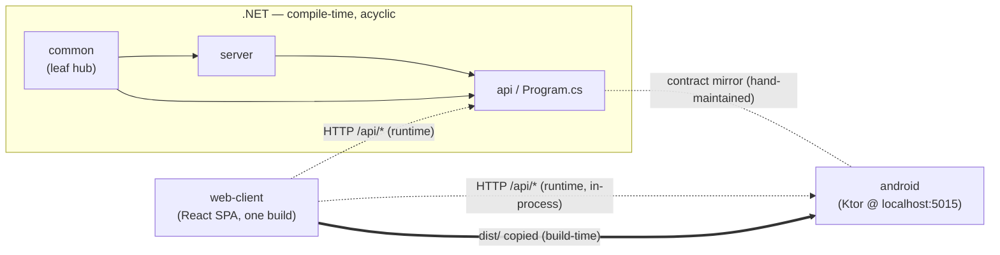

<!-- DeepInit Horizontal | Component: system-wide
Run ID: deepinit-2026-06-18
Input files processed: the 5 component docs + discovery.md
Generated: 2026-06-18 -->

# Technical Dependencies — Magav V-Notification-System

System-wide synthesis of how the five components depend on one another, where coupling concentrates, and what cascades when a contract changes.

---

## 1. Dependency Graph

### 1.1 Edge table

| From | To | Edge type | Mechanism | Evidence | Certainty |
|---|---|---|---|---|---|
| `server` | `common` | **COMPILE-TIME** (project ref) | `Magav.Server.csproj` `<ProjectReference>` → `Magav.Common`; imports `DbHelper`, `Models.*`, `MagavConstants` | `web/server/Magav.Server/Magav.Server.csproj:16-18`; `web/server/Magav.Server/Database/Repository.cs:5` | HIGH |
| `api` | `server` | **COMPILE-TIME** (project ref) | imports `MagavDbManager`, `AuthService`, `SmsReminderService`, `SmsSchedulerService`, `ShiftCleanupService`, `DbInitializer`, import services | `web/server/Magav.Api/Program.cs:9-11,74-98` | HIGH |
| `api` | `common` | **COMPILE-TIME** (project ref) | imports `Models.*`, `MagavConstants`, `DbHelper.CreateSqliteDbHelper`, `ApiResponse<T>` (the last re-exported via `Magav.Server.Services`) | `web/server/Magav.Api/Program.cs:5-8,78` | HIGH |
| `web-client` | `api` | **RUNTIME** (HTTP/JSON) | browser SPA calls `/api/*`; no source/compile edge into .NET | `web/client/src/services/*` (see web-client.md §6, IP-web-client:001-022) | HIGH |
| `android` (Ktor) | `api` | **RUNTIME / CONTRACT-MIRROR** | Android re-implements the same REST contract in Kotlin Ktor routes; not a code import — a hand-maintained parallel implementation | `android/.../api/routes/*` mirror the .NET endpoint set (api.md §8 ↔ android.md §8) | HIGH |
| `web-client` | `android` | **BUILD-TIME** (asset copy) | `build-apk.bat` builds React `dist/` and copies it into `android/app/src/main/assets/web/`; the Android WebView then loads it from `http://localhost:5015` | discovery.md §3; android.md IP-android:002; web-client.md §8 | HIGH |
| `web-client` | `android` (Ktor at runtime) | **RUNTIME** (HTTP, in-process) | inside the APK, the same SPA's `/api/*` calls hit the embedded localhost Ktor server instead of the .NET API | web-client.md BR-web-client:009 (default `apiBaseUrl = http://localhost:5015`); android.md IP-android:001-002 | HIGH |
| `server` → `common.DbHelper` → SQLCipher DB | runtime | DB I/O | NPoco over encrypted SQLite | server.md IP-server:002-003 | HIGH |
| `android` → Room → SQLCipher DB | runtime | DB I/O | Room DAOs over encrypted SQLite (a SEPARATE physical DB on the device) | android.md §5, IP-android:011 | HIGH |

### 1.2 Sketch

```
COMPILE-TIME (.NET, acyclic):

   common  ◄──────  server  ◄──────  api
  (leaf:               (services/         (Program.cs:
   Models,              repositories,      ~50 endpoints,
   DbHelper,            SMS subsystem,     DI, middleware,
   MagavConstants,      DbInitializer,     auth policies)
   Excel, crypto)       Auth, scheduler)

         efferent →               ← afferent
   (api depends on server+common; common depends on nothing internal)

RUNTIME / CONTRACT (no compile edge):

   web-client (React SPA, ONE build)
        │  HTTP /api/*
        ├───────────────► api  (Magav.Api, .NET)         [web deployment]
        └───────────────► android Ktor @ localhost:5015  [APK deployment]
                                  │
   build-apk.bat copies dist/ ──► android assets/web/  (WebView loads it)

   THREE-WAY API CONTRACT MIRROR:
      .NET api  ⇄  android Ktor  ⇄  consumed by web-client
      (same endpoint paths/DTOs implemented twice, consumed once)
```



`-->` solid = compile-time project reference; `-.->` dotted = runtime HTTP; `==>` = build-time asset copy; `-.-` = contract-mirror obligation (no code edge).

---

## 2. Circular Dependencies

**NONE among the .NET projects.** The chain `common → server → api` is strictly acyclic: `Magav.Common` has zero internal project references (it is the leaf, `Magav.Common.csproj:9-37`, confirmed common.md §4 boundary rules); `Magav.Server` references only `Magav.Common` (`Magav.Server.csproj:16-18`); `Magav.Api` references both but nothing references `Magav.Api`. No back-edge (`common`→`server`, `server`→`api`, or `api`→anything-internal) exists. **(IF-8 negative — no cycles.)** [HIGH]

At the runtime/contract layer there is also no cycle: `web-client` and `android` are sinks that consume the API contract; neither is imported by the .NET projects. The `web-client → android` asset copy and the `web-client → {api|android-ktor}` HTTP calls are one-directional. [HIGH]

The only relationship that *resembles* a cycle is the **contract-mirror** between `api` and `android` (each implements the same REST surface). This is NOT a dependency cycle — there is no code edge in either direction; it is a *replication obligation* (see §4 cascade risk). [HIGH]

---

## 3. Coupling Analysis

Afferent coupling (Ca) = number of components that depend ON this one. Efferent coupling (Ce) = number this one depends on. Compile-time edges only, except where noted.

| Component | Afferent (depended-on-by) | Efferent (depends-on) | Notes | Certainty |
|---|---|---|---|---|
| **common** | 2 (`server`, `api`) — **the shared hub** | 0 internal | Highest afferent in the system; every model/constant/DbHelper change radiates outward. Stable (changes should be rare); in practice churns moderately (DbInitializer-adjacent models). | HIGH |
| **server** | 1 (`api`) | 1 (`common`) | Middle layer; owns scheduler + auth + repositories. | HIGH |
| **api** | 0 (compile) / 2 runtime consumers of its *contract* (`web-client`, `android`-mirror) | 2 (`server`, `common`) | Top of the .NET stack; `Program.cs` is the single API hub (§3.1). | HIGH |
| **web-client** | 0 | runtime: `api` (web) OR `android` Ktor (APK); build-time consumer of `android` (its dist is copied there) | Pure sink at compile time; runtime-couples to whichever backend hosts it. | HIGH |
| **android** | build-time: consumes `web-client` dist | runtime-mirrors `api` contract; platform APIs (SmsManager/AlarmManager/Room) | Self-contained second implementation of the whole stack. | HIGH |

### 3.1 Identified hubs (high-fan-in / high-fan-out single files)

- **`common` is the shared data/utility hub.** Both `server` and `api` import its `Models.*` and `MagavConstants`; `server` additionally imports `DbHelper`. It is the single most-depended-on unit (Ca=2, the max for an internal .NET project here). `DbHelper.cs` (960 LOC) is itself a god object inside the hub — every repository in `server` funnels through it. [HIGH] (common.md §1, §10; structural-graph.json `common.imported_by`)
- **`Program.cs` (api) is the API hub — 2249 LOC.** Every one of ~50 endpoints, all DI registration, middleware, auth policies, and request/response DTOs live in this one file (api.md §10). High change-collision risk; it is the single point through which all web HTTP traffic is wired. [HIGH]
- **Android `ShiftRoutes.kt` is the Android API hub — 907 lines, 13 endpoints** with inline SMS-send logic duplicated across cancel/delete/send-sms/location-update (android.md §10). It is the Android-side counterpart to the shifts portion of `Program.cs`. [HIGH]
- **Secondary god objects** (size hubs, not dependency hubs): `web-client` `ShiftsManagementPage.tsx` (1135 lines), `common` `DbHelper.cs` (960), `server` `DbInitializer.cs` (859). [HIGH] (discovery.md §7)

---

## 4. Cascade Risk — "if X changes, what is affected?"

### 4.1 `common` Model / `MagavConstants` / `DbHelper` change → fans out to all of .NET (+ obligates Android)

A change to a `Magav.Common.Models.*` entity, to `MagavConstants` (the canonical `ReminderTypes` / `SmsStatuses` / `DayGroups` strings), or to the `DbHelper` API surface cascades **compile-time** into `server` (repositories, scheduler, auth) and `api` (DTO mapping, endpoint handlers), because both reference `common`. [HIGH] (structural-graph.json; common.md §8; server.md §9; api.md §9)

Because the persisted string values and the schema are **mirrored verbatim on Android** (CLAUDE.md "use the constants, never inline the strings"; android.md BR-android:006), the same change *also* obligates a matching edit in Android `util/Constants.kt` and the corresponding Room entity — but the compiler will NOT catch a missed Android update (no code edge). This is the first non-obvious cascade: **a `common` change is compiler-enforced inside .NET but only convention-enforced toward Android.** [HIGH]

A `DbHelper` behavioral change (e.g. the retry/transaction semantics in WF-common:001-004) cascades to every repository in `server` silently — no signature change, so it is the most dangerous kind of `common` edit. [MEDIUM — inferred from the fact that all repositories route through DbHelper]

### 4.2 API-contract change → THREE-WAY mirror cascade (the key non-obvious risk)

**The same REST endpoint contract is implemented THREE times:**
1. **.NET `api`** — `Program.cs` `app.Map*` endpoints (api.md §8).
2. **Android Ktor** — `android/.../api/routes/*` re-implement the identical paths/DTOs in Kotlin (android.md §8).
3. **Consumed by `web-client`** — the single React SPA's `services/*` call `/api/*` and expect the `ApiResponse<T>` `{success,data,message}` envelope (web-client.md §6, BR-web-client:007).

Therefore **any change to an endpoint's path, request DTO, response shape, auth policy, or validation rule obligates THREE coordinated edits**: the .NET handler, the Android Ktor route, AND the React service/typing — or the two backends silently diverge for the one shared client. [HIGH]

- Because `web-client` is one build served by BOTH backends, a contract change that lands in only one backend means the SAME UI works against the web deployment and breaks (or silently misbehaves) inside the APK, or vice-versa. The compiler catches none of this; there are no contract tests (§5 cross-references / 0 tests). [HIGH]
- Concrete live examples of where the three implementations are already kept in lockstep by hand: the file-upload validation pattern (CSRF header + ext + magic bytes + 10MB) appears in api.md BR-api:008, android.md BR-android:015, and is honored client-side by `X-Requested-With` (web-client.md BR-web-client:008); the soft-cancel convention (api.md BR-api:006, android.md WF-android:006, web-client.md IP-014); the "exact id-set match" bulk-scheduler-save rule (api.md BR-api:011 ↔ android.md BR-android:020). Each of these is a triple that must move together. [HIGH]

### 4.3 Schema change → dual-schema cascade (two independent DDL definitions)

The DB schema is defined **independently twice**: .NET `DbInitializer.cs` CREATE TABLE/migrations (server.md WF-server:005) and Android Room `@Entity` + migrations to `@Database(version=8)` (android.md BR-android:001-003). A column added on one side does NOT propagate to the other; on Android a botched entity change without the version-bump + migration triple **silently wipes the entire device DB** (CLAUDE.md 🚨; android.md BR-android:001-002). See `data-layer.md` §3 for the actual code-vs-code drift already present. [HIGH]

### 4.4 Background-service / scheduler change → behavioral mirror

The SMS-scheduler semantics (DayGroup = send-day, holiday-aware effective group, WeekdayAdvance pull-back window) are implemented in `server` (`SmsSchedulerService`/`SmsReminderService`, server.md WF-server:001-002,009, BR-server:003,007,008) AND in Android (`SmsSchedulerWorker`/`SmsReminderService`, android.md WF-android:002, BR-android:009,010), AND previewed in the client (`schedulerPreview.ts`, web-client.md BR-web-client:010,011). A change to the eligibility window or day-group ladder obligates all three to stay aligned, or the two platforms send different reminders from the same config. (MEMORY: "WeekdayAdvance window coupling" and "DayGroup semantics" call out exactly these coupling traps.) [HIGH]

### 4.5 Cascade summary

| Change at | Compile-time blast radius | Convention/contract obligation (NOT compiler-checked) |
|---|---|---|
| `common` Model / `MagavConstants` / `DbHelper` | `server` + `api` | Android `Constants.kt` + Room entity; client TS types |
| `server` service signature | `api` | Android service equivalent |
| `api` endpoint contract | (none — it's the top) | **Android Ktor route + web-client service** (three-way) |
| DB schema | `server` DbInitializer + repos | Android Room entity+migration (data-loss risk) |
| Scheduler/window logic | within `server` | Android worker + client `schedulerPreview.ts` |

---

### Summary
- .NET projects form an acyclic chain `common → server → api`; **no circular dependencies (IF-8 negative).**
- `common` is the shared hub (Ca=2); `Program.cs` and Android `ShiftRoutes.kt` are the large API hubs.
- The dominant non-obvious risk is the **three-way API-contract mirror** (.NET api / Android Ktor / consumed by one React client): an endpoint change must land in all three by hand, with no compiler or test to catch divergence.
